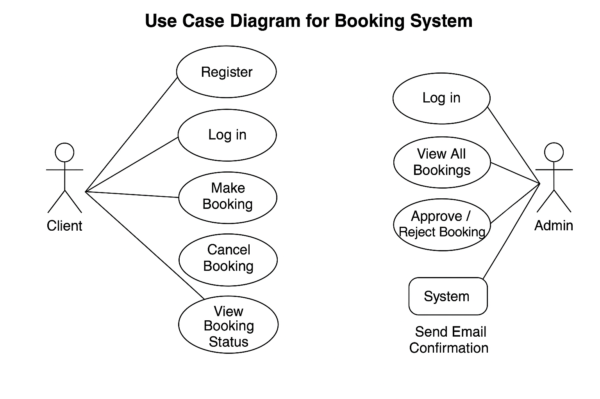

# requirement-analysis

## What is Requirement Analysis?

Requirement Analysis is the process of understanding what a software system needs to do by gathering and analyzing information from stakeholders. It helps define what features and functions the software should have, as well as how it should perform. This step is crucial in the software development lifecycle because it ensures that everyone—from clients to developers—is on the same page before any code is written. By clearly identifying requirements early on, teams can avoid misunderstandings, reduce costly changes later, and build a product that truly meets user needs.

## Why is Requirement Analysis Important?

Requirement Analysis plays a crucial role in the Software Development Life Cycle (SDLC) by laying the groundwork for a successful project. Here are three key reasons why it’s essential:
	1.	Prevents Miscommunication
It ensures that developers, stakeholders, and clients all have a shared understanding of what the system should do. This minimizes confusion and reduces the risk of building the wrong product.
	2.	Saves Time and Resources
By identifying and addressing potential issues early, Requirement Analysis helps avoid costly changes and rework later in the development process.
	3.	Defines Clear Project Scope
It helps set clear boundaries and expectations for what the software will include, reducing the chances of scope creep and keeping the project on track.

## 📌 Key Activities in Requirement Analysis

- **Requirement Gathering**  
  Collecting high-level needs and expectations from stakeholders using interviews, surveys, and observations.

- **Requirement Elicitation**  
  Refining gathered information through deeper engagement methods like workshops, brainstorming, and prototyping.

- **Requirement Documentation**  
  Creating detailed descriptions of functional and non-functional requirements in documents such as the Software Requirements Specification (SRS).

- **Requirement Analysis and Modeling**  
  Structuring and visually representing requirements using tools like use case diagrams or user stories to clarify system behavior.

- **Requirement Validation**  
  Reviewing and confirming the accuracy, completeness, and feasibility of requirements with stakeholders before development begins.

---

## 🧩 Types of Requirements

### 🔹 Functional Requirements

Functional requirements define the specific behaviors, actions, and functionalities of the system—essentially, **what** the system should do.

**Examples (Booking Management System):**
- Users can search for available properties.
- Users can register and log in securely.
- Users can book a property.
- Admin can add, edit, or remove listings.

### 🔸 Non-functional Requirements

Non-functional requirements describe **how** the system should perform. These include system attributes like performance, reliability, scalability, and security.

**Examples (Booking Management System):**
- The system should load any page in under 2 seconds.
- The system must handle up to 10,000 concurrent users.
- The website must be mobile responsive.
- All personal user data must be encrypted and securely stored.

---

## 📈 Use Case Diagrams

### What is a Use Case Diagram?

A **Use Case Diagram** is a visual representation of the interactions between users (actors) and the system (use cases). It shows what functionality is offered by the system from an end-user perspective and helps identify key interactions.

### Benefits:
- Clarifies system requirements.
- Enhances communication between stakeholders and developers.
- Provides a high-level overview of the system’s functionality.

### Use Case Diagram – Booking Management System

**Actors:**
- Guest User
- Registered User
- Admin

**Use Cases:**
- Register / Login
- Search Properties
- Book Property
- Cancel Booking
- Manage Listings (Admin)
- View Booking History

---

## ✅ Acceptance Criteria

### What is Acceptance Criteria?

**Acceptance Criteria** are the predefined conditions a feature must meet to be accepted by the product owner or stakeholders. They provide clear definitions of success for each feature.

### Why It’s Important:
- Ensures everyone agrees on what “done” means.
- Helps developers build features that meet business goals.
- Assists testers in validating correct behavior of the application.

### Example – Checkout Feature

**User Story:**  
_As a registered user, I want to securely complete my booking so that I can reserve a property._

**Acceptance Criteria:**
- User must be logged in to access the checkout.
- Checkout page displays booking summary (property name, dates, price).
- User can enter payment details securely.
- A payment gateway processes transactions.
- User receives confirmation after successful payment.
- System updates property availability in real-time.